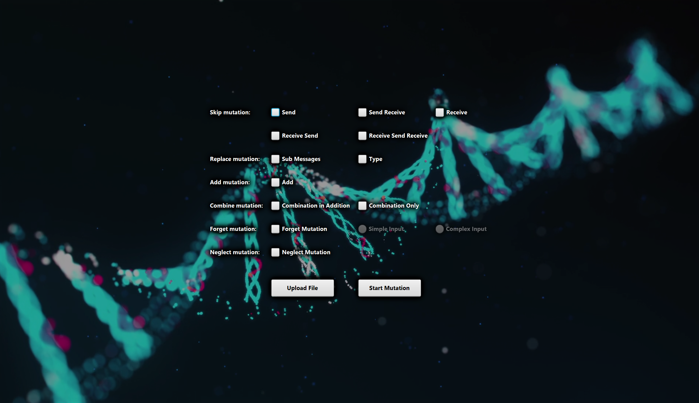

# X-Men

## X-Men: A Mutation-Based Approach for the Formal Analysis of Security Ceremonies

---

## Table of Contents

- [About The Project](#about-the-project)
- [Built With](#built-with)
- [Getting Started](#getting-started)
    - [Installing Java and Maven](#installing-java-and-maven)
    - [Setting Up Path Variables](#setting-up-path-variables)
    - [Installing Git](#installing-git)
    - [Cloning the Project](#cloning-the-project)
    - [Installing IntelliJ IDEA](#installing-intellij-idea)
    - [Building and Running the Project](#building-and-running-the-project)
    - [Setting Up Postman](#setting-up-postman)
- [Haskell Derivation Service Integration](#haskell-derivation-service-integration)
    - [Overview](#haskell-overview)
    - [Setup and Configuration](#haskell-setup-and-configuration)
    - [Usage](#haskell-usage)
    - [How It Works](#haskell-how-it-works)
- [API Endpoints](#haskell-api-endpoints)

---

## About The Project

Security ceremonies often expand protocols to include user actions and behaviors, encompassing all human-induced vulnerabilities in systems (e.g., payment, voting, or critical infrastructure systems). X-Men automates analyzing and mutating security ceremonies by focusing on:

- Modeling human behaviors and errors during ceremonies.
- Mutating the ceremony to test vulnerabilities and implementation flaws.

X-Men builds upon formal modeling techniques to uncover vulnerabilities in real-world scenarios. Three case studies have been analyzed using this tool, revealing critical issues.

---

## Built With

This project uses the following technologies and frameworks:

- [Java 21](https://www.oracle.com/java/technologies/javase/jdk21-archive-downloads.html)
- [Maven](https://maven.apache.org/)
- [Spring Boot](https://spring.io/projects/spring-boot)

---

## Getting Started

Follow these steps to set up the project locally and start working with X-Men.

### Installing Java and Maven

1. **Java 21**:
    - Download Java 21 from [here](https://www.oracle.com/java/technologies/javase/jdk21-archive-downloads.html).
    - Follow the installation instructions for your operating system.

2. **Maven**:
    - Download Maven from [here](https://maven.apache.org/download.cgi).
    - Follow the installation instructions.

---

### Setting Up Path Variables

1. **Windows**:
    - Right-click on `This PC` or `My Computer`, select `Properties` -> `Advanced system settings` -> `Environment Variables`.
    - Under `System Variables`, click `New` and add:
        - `JAVA_HOME`: Path to your Java installation (e.g., `C:\Program Files\Java\jdk-21`).
        - `MAVEN_HOME`: Path to your Maven installation (e.g., `C:\Program Files\Maven`).
    - Add `%JAVA_HOME%\bin` and `%MAVEN_HOME%\bin` to the `Path` variable.

2. **macOS**:
    - Open the terminal and edit your shell configuration file (`~/.zshrc` or `~/.bash_profile`):
      ```bash
      export JAVA_HOME=/Library/Java/JavaVirtualMachines/jdk-21.jdk/Contents/Home
      export MAVEN_HOME=/opt/apache-maven
      export PATH=$JAVA_HOME/bin:$MAVEN_HOME/bin:$PATH
      ```
    - Save and reload the file:
      ```bash
      source ~/.zshrc
      ```

#### Verify Installation

- **Java**:
  ```bash
  java -version
  ```
- **Maven**:
  ```bash
  mvn -version
  ```

---

### Installing Git

#### Windows

1. Download Git from [git-scm.com](https://git-scm.com/).
2. Run the installer and follow the setup wizard.
3. During installation, choose `Git Bash` as the default terminal emulator.
4. Verify the installation:
   ```bash
   git --version
   ```

#### macOS

1. Open the terminal and install Git using Homebrew:
   ```bash
   brew install git
   ```
2. Verify the installation:
   ```bash
   git --version
   ```

---

### Cloning the Project

1. Open a terminal.
2. Clone the repository:

   ```bash
   git clone https://github.kcl.ac.uk/SERMAS/X-Men_3.0.git
   cd x-men
   ```

---

### Installing IntelliJ IDEA

1. **Download IntelliJ IDEA Community Edition**
    - Download from [IntelliJ IDEA](https://www.jetbrains.com/idea/download/).
    - Install it by following the instructions for your operating system.

2. **Open the Project**
    - Launch IntelliJ IDEA and select `Open`.
    - Navigate to the cloned `x-men` repository folder and open it.

3. **Set Up Maven**
    - IntelliJ will automatically detect the `pom.xml` file and import the Maven project.
    - If not, right-click on the `pom.xml` file and select `Add as Maven Project`.

---

### Building and Running the Project

1. **Build the Project**
    - Open the internal terminal in IntelliJ IDEA (`View -> Tool Windows -> Terminal`).
    - Run the build command:
      ```bash
      mvn clean install
      ```

2. **Run the Application**
    - In IntelliJ, go to `Run -> Edit Configurations`.
    - Click `+` and select `Spring Boot` -> `Application`.
    - Choose the main class of the application.
    - Modify Options -> Add VM Options -> `-Djava.awt.headless=false`.
    - Add Environment Variables -> `JAVA_OPTS` = `-Djava.awt.headless=false`.
    - Save the configuration
    - Click `Run` to start the application to start Native UI.

3. **Access the Application via Native UI**
    - Select Checkbox for required mutation
    - Upload `.spthy` file containing input rules
    - Click on `Start Mutation`
   
      

4. **Access the Application via API**: Details Below
---

### Setting Up Postman

1. **Download Postman**
    - Download Postman from [here](https://www.postman.com/downloads/).

2. **Import the Collection**
    - In Postman, click `Import`.
    - Navigate to the `src/main/resources` folder of the project.
    - Select the collection file named `X-Men.postman_collection.json.`.
    - Postman will load the requests into a collection for testing.
    - Click on the folder named 'Mutations (Generate Mutations)'

3. **Make a Request**
    - Ensure the application is running in IntelliJ IDEA.
    - Use Postman to send a request from the imported collection to test the system functionality.

---

## Haskell Derivation Service Integration

### <a name="haskell-overview"></a>Overview

X-Men integrates with an external **Haskell derivation-tree microservice** to provide advanced derivation analysis for Forget mutations. This integration allows you to:

- **Analyze protocol derivability** using Haskell-based logic
- **Visualize derivation trees** for protocol message flows
- **Determine if targets are derivable** from the intruder's knowledge
- **Make informed mutation decisions** based on Haskell derivation results

The integration is **optional** and **header-driven** — you can enable it per request without affecting standard behavior.

---

### <a name="haskell-setup-and-configuration"></a>Setup and Configuration

#### 1. **Haskell Service Requirements**

The Haskell derivation service should:
- Run on **port 9091** (configurable)
- Expose a `POST /derive` endpoint
- Accept plain text input (converted protocol format)
- Return derivation tree analysis

#### 2. **Configuration**

In `application.yaml`:
```yaml
derivation:
  service:
    url: ${DERIVATION_SERVICE_URL:http://localhost:9091}
```

**Environment Variable Override:**
```bash
export DERIVATION_SERVICE_URL=http://custom-host:9091
```

#### 3. **Start the Haskell Service**

Ensure the Haskell derivation service is running before using the integration:
```bash
# Start your Haskell service on port 9091
./derivation-service
```

---

### <a name="haskell-usage"></a>Usage

#### **Activating Haskell Derivation**

Add the `Haskell-Activate: true` header to your Forget mutation requests:

**Using cURL:**
```bash
curl -X POST http://localhost:8081/api/forget/mutations \
  -H "Haskell-Activate: true" \
  -F "file=@Oyster.spthy" \
  -o mutations.zip
```

**Using Multi-Endpoint:**
```bash
curl -X POST http://localhost:8081/api/generateMutations \
  -H "Forget-Mutation: true" \
  -H "Haskell-Activate: true" \
  -F "file=@CoachService.spthy" \
  -o mutations.zip
```

**Using Postman:**
1. Select a Forget mutation request
2. Go to the **Headers** tab
3. Add: `Haskell-Activate` with value `true`
4. Send the request

#### **Without Haskell (Standard Behavior)**

Simply omit the `Haskell-Activate` header:
```bash
curl -X POST http://localhost:8081/api/forget/mutations \
  -F "file=@Oyster.spthy" \
  -o mutations.zip
```

The system will use the standard Java-based derivation logic.

---

### <a name="haskell-how-it-works"></a>How It Works

#### **Architecture**

```
1. Parse SPTHY File
   ↓
2. Convert Rules → Haskell Format
   ↓
3. Call Haskell Service (POST /derive)
   ↓
4. Receive Derivation Tree
   ↓
5. Print Tree to Console
   ↓
6. Parse Result → Determine Derivability
   ↓
7. Use Result for Forget Mutation Decisions
```

#### **Conversion Process**

The `HaskellFormatConverter` transforms your SPTHY rules into a structured format the Haskell service understands:

**Input (SPTHY):**
```tamarin
rule setup:
  [Fr(~kS)]
  --[OnlyOnce(), Roles($Client,$S,$D)]->
  [ State($S,'1',<~kS,$D>)
  , State($Client,'1',<$S>)
  ]

rule H_1:
  [ State($Client,'1',<$S>) ]
  -->
  [ SndS($Client,$S,journey) ]
```

**Converted Output (Haskell Format):**
```
PROTOCOL: CoachService

INITIAL_KNOWLEDGE:
  Client
  S
  D
  pub(a)
  pub(b)

MESSAGES:
  M1: from Client to S: journey
  M2: from S to Client: solution

GOAL: derive(shared_key)
```

#### **Derivation Logic**

1. **Haskell Enabled**: `HybridDerivationService` routes derivation calls to Haskell
2. **Haskell Service**: Analyzes protocol and returns derivation tree
3. **Derivability Check**: Parses Haskell response to determine if target is derivable
4. **Mutation Decision**: Forget mutation proceeds or skips based on derivability

#### **Console Output Example**

```
================================================================================
HASKELL DERIVATION TREE FOR: CoachService
Target: (ticket, encTicket)
================================================================================

========================================
       DERIVATION TREE ANALYSIS        
========================================

Initial intruder knowledge 
l_0->Client
l_1->S
l_2->D
l_3->Pub(privk_a)

Receiving first message from Client and analyzing
l_4-><date, dtime, from, to>

Can the intruder derive session key?
[Aenc(l_3, l_4)]

========================================

================================================================================

Haskell derivation result: target is DERIVABLE
Target IS derivable from knowledge. Skipping mutation.
```

---

### <a name="haskell-api-endpoints"></a>API Endpoints

#### **1. Forget Mutations with Haskell (Simple vs Complex Input)**

**Endpoint:** `POST /api/forget/mutations`

- **Purpose:** Generate *Forget* mutations, i.e., rules where a selected value is "forgotten" and the intruder knowledge is adapted.
- **Input:** Multipart form upload with a single `.spthy` file.
- **Output:** A `.zip` archive containing mutated `.m` files.

**Headers:**
- *(optional)* `Haskell-Activate: true` → enable **complex input** mode and call the external Haskell derivation service.
  - When **absent**: X-Men uses its built-in Java derivation (simple input mode).
  - When **present**: X-Men forwards a converted model to the Haskell service and uses its derivation result.

> To trigger the Haskell-based derivation service, ensure the external app from
> `https://github.kcl.ac.uk/SERMAS/Derivation-Service` is running (default: `http://localhost:9091`).

**Example Requests:**

- Simple input (Java-only):
  ```bash
  curl -X POST "http://localhost:8081/api/forget/mutations" \
    -F "file=@path/to/your/input.spthy" \
    -o forget_mutations_simple.zip
  ```

- Complex input (Haskell activated):
  ```bash
  curl -X POST "http://localhost:8081/api/forget/mutations" \
    -H "Haskell-Activate: true" \
    -F "file=@path/to/your/input.spthy" \
    -o forget_mutations_haskell.zip
  ```

---

## API Reference (from Postman Collection)

This section summarizes the HTTP API exposed by X-Men as captured in `src/main/resources/X-Men.postman_collection.json`.

All endpoints listen on `http://localhost:8081` by default and expect a single `.spthy` file uploaded as `file` in `multipart/form-data` unless stated otherwise.

### 1. Health Checks

#### `GET /actuator/health/`

- **Purpose:** Check if the Spring Boot application is up.
- **Response:** Standard Spring Boot health JSON (liveness/readiness, disk space, etc.).

---

### 2. Individual Mutation Endpoints

These endpoints each perform **one specific mutation pattern** and return a `.zip` of mutated models.

Each request:
- Method: `POST`
- Body: `form-data` with key `file` → your input `.spthy` model
- Response: `application/octet-stream` (`.zip` containing `.m` files)

#### 2.1 `POST /api/skip/sendMutations` – *Skip Send*
- **Mutation type:** Remove or skip selected `Send(...)` actions from rules.
- **Effect:** Models scenarios where a participant **fails to send** an expected message.

#### 2.2 `POST /api/skip/receiveMutations` – *Skip Receive*
- **Mutation type:** Remove or skip selected `Receive(...)` actions.
- **Effect:** Models scenarios where a participant **ignores or misses** an incoming message.

#### 2.3 `POST /api/skip/sendReceiveMutations` – *Skip Send → Receive chain*
- **Mutation type:** Skip a `Send` followed by its corresponding `Receive`.
- **Effect:** Models end-to-end message loss on the channel.

#### 2.4 `POST /api/skip/receiveSendMutations` – *Skip Receive → Send chain*
- **Mutation type:** Skip a `Receive` and the subsequent `Send` that depends on it.
- **Effect:** Models a participant not reacting to a received message.

#### 2.5 `POST /api/skip/receiveSendReceive` – *Skip Receive → Send → Receive chain*
- **Mutation type:** Skip a longer chain of dependent actions.
- **Effect:** Models more complex user or network failures across multiple steps.

#### 2.6 `POST /api/addMutations` – *Add Mutation*
- **Mutation type:** Add extra rules or messages to the model.
- **Effect:** Models **unexpected extra behavior**, such as a user sending an additional message.

#### 2.7 `POST /api/replace/subMessagesMutations` – *Replace Sub-messages*
- **Mutation type:** Replace sub-parts of messages (e.g., change a nonce, user ID, or field inside a tuple).
- **Effect:** Models **data entry errors** or **message tampering** on subfields.

#### 2.8 `POST /api/replace/typeMutations` – *Replace Type*
- **Mutation type:** Replace the type tag in `Type(...)` annotations.
- **Effect:** Models misuse of credentials, e.g., using a password where a user ID was expected.

#### 2.9 `POST /api/neglect/mutations` – *Neglect Mutation*
- **Mutation type:** Drop or neglect parts of the postcondition state.
- **Effect:** Models **forgetfulness or omission**, such as not storing a value for later use.

#### 2.10 `POST /api/forget/mutations` – *Forget Mutation (Simple Input)*
- **Same endpoint as in 1**, but without `Haskell-Activate` header.
- **Mutation type:** Forget a chosen value from the state and check derivability using Java-only logic.

#### 2.11 `POST /api/forget/mutations` – *Forget Mutation (Complex Input)*
- **Headers:** `Haskell-Activate: true`.
- **Mutation type:** Same as above, but derivability is decided via the external Haskell derivation service.
- **Important:** Requires the external Derivation-Service to be running (see below).

---

### 3. Combined Mutation Endpoint – `POST /api/generateMutations`

This endpoint drives the **main mutation engine**. Which mutations are applied is controlled by HTTP headers.

**Base Endpoint:** `POST /api/generateMutations`

- **Input:** Multipart form with `file=@your_model.spthy`.
- **Output:** `.zip` with all generated mutant models.

#### 3.1 Skip-based Mutations

Set one or more of these headers to `true`:

- `Skip-Send` → enable **Skip Send** mutations.
- `Skip-Receive` → enable **Skip Receive** mutations.
- `Skip-Send-Receive` → enable **Skip Send Receive** chain.
- `Skip-Receive-Send` → enable **Skip Receive Send** chain.
- `Skip-Receive-Send-Receive` → enable **longer skip chains**.

#### 3.2 Add / Replace / Neglect Mutations

- `Add-Mutation: true` → add extra rules/messages.
- `Replace-Sub-Messages: true` → replace message subcomponents.
- `Replace-Type: true` → mutate type annotations.
- `Neglect-Mutation: true` → neglect selected state components.

#### 3.3 Forget Mutations (from Combined Endpoint)

- `Forget-Mutation: true` → enable **Forget mutations** inside the combined generator.
- `True-Replace: true` → for certain configurations, enables knowledge-based replacements rather than purely random ones.
- `Haskell-Activate: true` → route Forget derivation to the external Haskell service (complex input).

**Examples:**

- Only Skip Send:
  ```bash
  curl -X POST "http://localhost:8081/api/generateMutations" \
    -H "Skip-Send: true" \
    -F "file=@path/to/model.spthy" \
    -o mutants_skip_send.zip
  ```

- Add + Replace Sub-messages + Replace Type (combined):
  ```bash
  curl -X POST "http://localhost:8081/api/generateMutations" \
    -H "Add-Mutation: true" \
    -H "Replace-Sub-Messages: true" \
    -H "Replace-Type: true" \
    -F "file=@path/to/model.spthy" \
    -o mutants_add_replace.zip
  ```

- Add Replace Sub-messages **only** (knowledge-based):
  ```bash
  curl -X POST "http://localhost:8081/api/generateMutations" \
    -H "Replace-Sub-Messages: true" \
    -H "True-Replace: true" \
    -F "file=@path/to/model.spthy" \
    -o mutants_true_replace.zip
  ```

- Forget mutation with Haskell derivation:
  ```bash
  curl -X POST "http://localhost:8081/api/generateMutations" \
    -H "Forget-Mutation: true" \
    -H "Haskell-Activate: true" \
    -F "file=@path/to/model.spthy" \
    -o mutants_forget_haskell.zip
  ```

> **Note:** When combining multiple headers, the mutation engine will generate
> mutants for **all enabled mutation types** over the given model.

---

### 4. External Derivation Service

X-Men integrates with a separate **Derivation-Service** microservice for complex Forget mutations.

- Repository: `https://github.kcl.ac.uk/SERMAS/Derivation-Service`
- Default URL: `http://localhost:9091`

#### 4.1 Healthcheck

- **Endpoint:** `GET /health`
- **Example:**
  ```bash
  curl http://localhost:9091/health
  ```

#### 4.2 Sample Derivation Request

- **Endpoint:** `POST /derive`
- **Headers:** `Content-Type: text/plain`
- **Body:** Plain text derivation command (generated by X-Men internally).
- **Example:**
  ```bash
  curl -X POST "http://localhost:9091/derive" \
    -H "Content-Type: text/plain" \
    -d "derive ex_f1 ex_r"
  ```

When you enable `Haskell-Activate: true` on Forget-related requests, X-Men
internally builds and sends a request like this to the Derivation-Service and
uses its response to decide whether a value is derivable and whether a
particular mutation should be applied.
